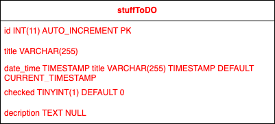

## Beskrivning
#### En enkel att-göra lista skriven på engelska där man kan lägga till uppgifter (innehållande en titel samt beskrivning), redigera samtliga uppgifter i efterhand, markera dem som klara och sedan ta bort dem.

## Steg-för-steg
#### Nedan finner du de nödvändiga stegen för att köra denna applikation
1. Först och främst behöver du klona/ladda ner repositoryn från GitHub. Klonar du den till din dator, i valfri mapp, så ska skriva följande i terminalen:
`git clone https://github.com/chas-academy/u03-todo-Shah-Sabouri.git`
2. Se till att Docker Desktop är installerad på din dator, sedan efter du har öppnat mappen i fråga med VSCode så ansluter du applikationen till databasen genom att skriva följande i terminalen:
`docker compose up -d --build`. Vill du avbryta anslutningen så skriver du `docker compose down`. Eftersom SQL-seed-filen redan är en del av applikationen så kommer alla nödvändiga tabeller att skapas i databasen per automatik.
3. I Docker Desktop kommer du åt den färdiga applikationen via Localhost (e.g. din webbläsare) genom att gå in på Containers-fliken och sedan klicka på länken där det står 80:80 bredvid repositoryns namn, sedan är allt klart.

## ER-DIAGRAM

## FIGMA SKETCH

